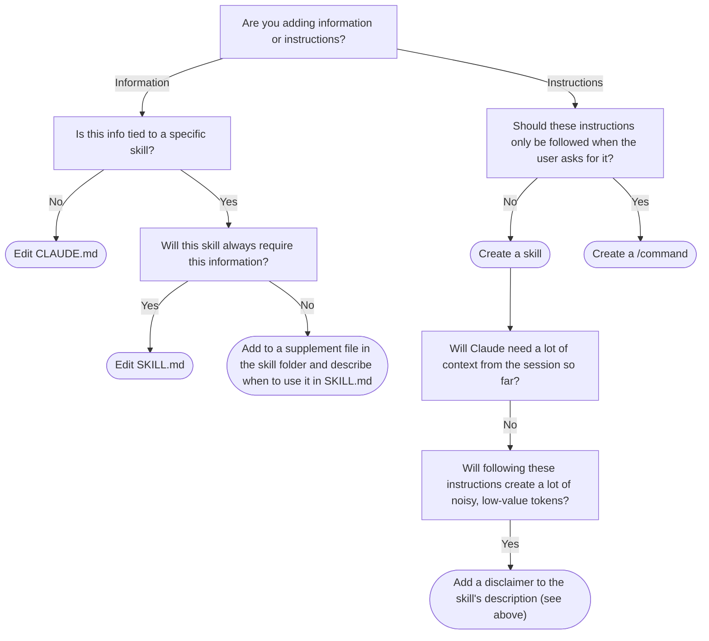

# highrise-studio

A plugin that makes Claude Code a Highrise Studio wizard.

## Development philosophy
When you want to change Claude Code's behavior, there are three places you could edit:
### Memory
Each Highrise Studio project is initialized with the same `CLAUDE.md` file, defined in `skills/setup-highrise-studio-project/claude-docs/`. Any time Claude Code is started in that project, its `CLAUDE.md` file will be read into context and define Claude Code's behavior. 
- **Do:** add context about Highrise, Highrise Studio, Worlds, and the structure of Highrise Studio projects
- **Don't:** describe how to do specific tasks; use a Skill or Command instead

### Skills
Claude Code can execute skills as it chooses, defined in folders in `skills/`. Each skill folder contains a set of instructions in `SKILL.md`, and may also contain supporting documents and scripts that can be referenced while executing the skill. Skills can be used by both the main Claude Code agent and any spawned subagents.
- **Do:** provide explicit instructions on how to perform specific tasks
- **Don't:** describe tasks that only the user can invoke (use a Command)

### Commands
Users of Claude Code can invoke commands defined in Markdown files in `commands/`. Each Markdown file contains a prompt that will be passed to Claude Code when the user types `/<command-name>` into their terminal. Claude Code will not execute these commands without receiving the explicit slash-command.
- **Do:** create commands to capture tasks that users commonly want to do
- **Don't:** describe tasks that you want Claude Code to do without the user specifically typing it

### What about subagents?
Claude Code can create subagents as needed, each of which is like a "mini Claude Code" to which a specific task is delegated. Each subagent has its own system prompt, its own context window, and independent access to Claude Code's skills and tools. The main agent will spawn the subagent, give it a task, and then wait for the subagent to return a response to the task. This can be very useful if:
1. **The task does not require the complete session context so far.** Since the subagent has its own context window, it will not be distracted by anything except the specific task the main agent asks of it.
2. **The task produces a lot of intermediate output that is not useful.** Since the main agent only "sees" the subagent's final response, its context will not be polluted by whatever the subagent does to produce that final response, like parsing documents or running scripts.

By default, Claude Code can create general-purpose subagents. In a Claude Code plugin like this one, you can also define behavior for custom subagents in Markdown files under `agents/`. If Claude Code wants a subagent to do a particular task (say, debug some code) and there is a relevant subagent file (say, one called `code-debugger.md`) Claude Code will use that file's contents as the system prompt for the subagent, rather than a general-purpose system prompt. This can guide the behavior of the subagent.

I think subagents are super useful, and can accomplish focused tasks without polluting session context. That being said, **I am not a huge fan of custom subagents**, and I think skills should be preferred in most cases, for two reasons:
1. **Subagent prompts are not easily composable.** Let's say you have a task that requires iteratively debugging some code and making Lua changes as you go. If you have both a `code-debugger.md` subagent that knows how to run the iterative loop and a `lua-expert.md` subagent that knows the Lua API, it's not clear how to use both of these to accomplish this task. Swapping back and forth between subagents incurs a lot of overhead, while creating another subagent prompt that combines the other two quickly gets combinatorially complex. I think it is preferable to instead have a debugging skill and a Lua API skill that a single general-purpose agent can choose to use one or both of.
2. **Subagent prompts lack progressive disclosure.** Let's say you have a subagent for parsing PDFs. A simple PDF might use ~10% of the PDF spec; ideally, we wouldn't need to give the subagent context about the other 90% (wasting time and tokens) unless it's parsing a particularly complicated PDF. However, subagent prompts are automatically added in their entirety to the context window. With skills, you can break context across files that are read only as-needed.
3. **Skills are more reusable.** A skill can be used by either the main agent or by subagents. Even if you're confident that a skill should only be used in subagents (maybe it generates a lot of noise), you can just specify in the skill that it should fire off a subagent, with a diclaimer like:
    > **IMPORTANT:** if you are reading this, then IMMEDIATELY invoke a general-purpose subagent and provide it all of the content in the skill *exactly*, except with (a) this line removed and (b) any additional context the subagent needs to execute the skill. DO NOT EXECUTE THE FOLLOWING INSTRUCTIONS YOURSELF.

### I want to add X. Where should I do it?

