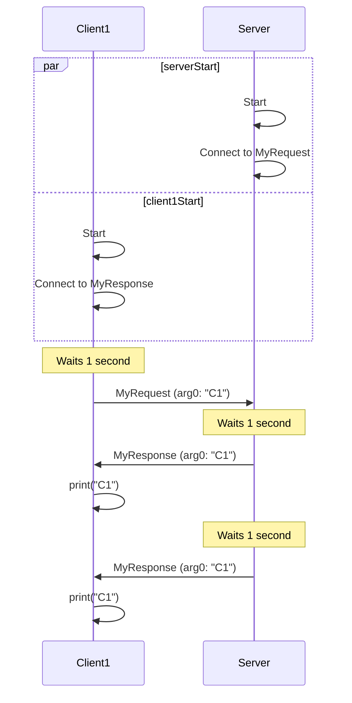

# Event report: $SCENARIO

<!-- Give a brief description of the scenario that the user is asking about. -->

## Relevant events
### `MyRequest`
- Created in: `MyScript1.lua`
- Local? `Yes` or `No`
- Fired in:  <!-- add one entry for each occurrence of a `Fire*()` call -->
    - `MyScript1.lua:PublicFunction1()`
        - **Is this function local?** TODO
        - **What functions, if any, call this function?** TODO
        - **Is this function called on the client, the server, or both?** TODO
        - **When this function is called, what conditions must be met for the event to be fired?** TODO
        - **What type of `Fire*()` call is this?** TODO (Client, Server, AllClients, etc.)
        - **What arguments, if any, are passed to the `Fire*()` call?** TODO
    - ...
- Connected to in:  <!-- add one entry for each occurrence of a `Connect()` call -->
    - `MyScript2.lua:PublicFunction2()`
        - **Is this function called on the client, the server, or both?** TODO
        - **When this function is called, what conditions must be met for the event to be connected to?** TODO
        - **What arguments does the callback depend on?** TODO
        - **What does the callback do?** TODO
    - ...

### `MyResponse`
... <!-- repeat the above sections for each event -->

## Sequence diagram <!-- Show what would be the most common or intended sequence of events for this scenario. -->
In this diagram, ... <!-- Describe the situation that the sequence diagram is representing. For example, "...a single client connects at the same time as the server." -->

## Race conditions
 <!-- Describe any potential race conditions that may occur in the current implementation and lead to unexpected behavior. -->
1. If two clients join at the same time, both will receive the same name from the server instead of their own names.
2. ...